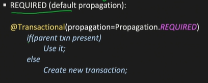
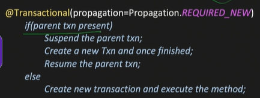
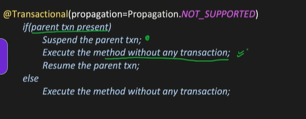
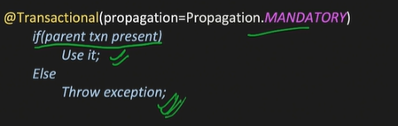
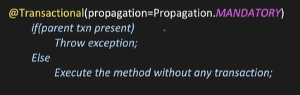
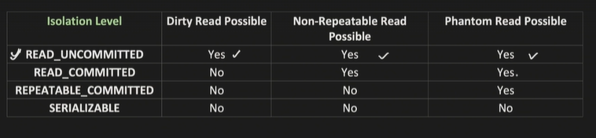
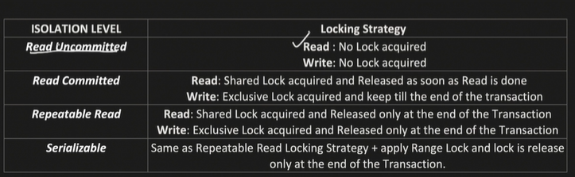

# VIDEO NO - 52

## Content studied: (Annotations)
Studied about various annotations.

- @Component
- @Bean
- @Autowired
- @Lazy
- @PostConstruct
- @PreDestroy
- @RestController - Used to created controllers
- @ResponseBody 
- @Scope("")
- @Primary - Used to tell which object out of multiple objects to choose at the time of autowiring
- @Qualifier - Used to tell which object to fill at the time of autowiring
- @RequestMapping(path="") - Used at class level to common url (eg. /api/)
- @GetMapping(path=""), @PostMapping(path=""), etc - Used to create different type of api's like get, post, patch, delete, etc
- @RequestParam(name="", required=true/false) - Get parameter value from the url (eg. /api/fetchUser?firstName=Ashutosh&lastName=Kumar)
- @InitBinder - used for preprocessing of the parameters obtained from the url before actual business logic runs. (watch its function syntax when in use from Gemini)
- PathVariable(value="") - Extract variable from the url (eg. /api/fetchUser/Ashutosh)
- @RequestBody - Used for extracting JSON object from the request
- @JsonProperty("") - Used to set properties value when there name differ in the class.property and in the request body object
- ResponseEntity<> - Syntax-> ResponseEntity.status(HttpStatus.OK).body();

# VIDEO NO - 53

## Content Studied: (Dependency Injection)

- Types - Field Injections, Setter Injection, Constructor Injection

# VIDEO NO - 54

## Content Studied: ( Bean Scopes | Singleton, Prototype, Request, Session Scopes)

### Singleton Scope
- Default scope of any bean is Singleton (means only one instance of this class is created by IOC).
- Singleton are eagarly initialized.

- @Scope("singleton")

### Prototype Scope

- Each time new Object is created.
- Its lazily initialized
- @Scope("prototype")

### Request Scope

- New object is created for each HTTP request. and only for http requests, its bean is created.
- Lazily initialized
- @Scope("request")

### Scenario: 
- Suppose you have a singleton scope class and inside it, you used autowired for a class object whose scope is "request". Now at the time of running the application, the bean creation will fail and give error because singleton classes are eagarly initialized, when IOC try to creates its bean, it try to inject the autowired object, but that autowired object is marked with "request" scope and objects of request scope only get created for http requests and here there is no http request called right now.
- So, to solve this problem, we insert a dummy object initially to prevent breaking of the bean creation. We put following syntax at the top of "request" scope bean

- @Scope(value = "request", proxyMode = ScopedProxy.TARGET_CLASS)

### Session Scope

- New object is created for each HTTP session
- Lazy initialized
- When user accesses any endpoint, session is created
- Remains active, till it does not expire
- @Scope("session")

# VIDEO NO - 55

## Content studied - (Dynamically Initialized Beans | Value Annotation)

# VIDEO NO - 56

## Content Studied - (@ConditionalOnProperty Annotation)

- Bean is created conditionally
### How can we unclutter our application when started - using @ConditionalOnProperty - **INTERVIEW QUESTION

- You put it on top of the class which you want to create conditionally
- Syntax -> @ConditionalOnProperty(prefix = "sqlconnection", value = "enabled", havingValue = "true", matchIfMissing = false/true)

- You also have to give required value with @Autowired in the class where this conditionaly dependency is injected. We have to give this required value as false because if we dont give it, by default it means required is true and if required is true, that dependency have to be resolved (compulsory) for application to run.
- @Autowired(required = false).

### This sqlconnection.enabled=anyString is stored in the application.properties file. To fulfill the condition for creating the bean, havingValue should match with the prefix.value (here value is "true"). If not matched , bean is not created. Suppose if prefix.value is not present in the application.properties file, then matchIfMissing is used.

# VIDEO NNO - 57

## Content studied - (Profiling and @Profile annotation)

- We have different enviroments and for different enviroments, we have different configurations. For that, we use profiling.
- Used to different values of same field according to your profile.
- There is a parent application.properties file. And you create multiple profile (as many as you want) by creating files appliation-{profileName}.properties. There all files create common properties values have different values.
- To set the profile, in your parent application.properties file, you set this property
#### spring.profiles.active = profileName

- @Value("${propertyName same as in application.properties file}")  - used to fill property value by taking from the application.properties file

- You can set profile at runtime by various ways (no need to manually change profile in appilcation.properties file). Seach about them using Gemini (commands to run on terminal while starting the application)

- Add this annotation at top of the class which you want to configure according to the specific enviroment.
- Bean with specific enviroment/profile is created only when profile (set int the parent application.properties file) is matching with the @Profile annotation.
- @Profile("prod") or @Profile("dev")

# VIDEO NO - 58

## Content studied - (AOP - Aspect Oriented Programming)

- It helps to intercept the method invocation and we can perform some task before and after the method
- AOP allows us to focus on the business logic by handling boilerplate and repititive code like logging, transaction management, security etc.
- Helps in achieving reusability, maintanability ot the code

- We have to add AOP dependency in pom.xml file
- @Aspect - used this at the top of the class which contains the code (function) which you want to run before or after 
- @Before("execution(method name before or after you want to run this particular code)")

## Use wildcards

### (*) -> Match any return type

- @Before("execution(* com.concept.learning.Employee.fetchEmployee())") -> match particular method with any return type 
- @Before("execution(* com.concept.learning.Employee.*(String))") -> match any method with any return type which takes a string as argument
- @Before("execution(String com.concept.learning.Employee.fetchEmployee(*))") -> match particular method with string return type and takes atleast one arguments

### (..) -> Match 0 or more item

- @Before("execution(String com.concept.learning.Employee.fetchEmployee(..))") -> match particular method with string return type and takes 0 or more arguments
- @Before("execution(String com.concept..fetchEmployee())") -> match fetchEmployee method with string return type but from any package inside concept or concept package
- @Before("execution(String com.concept..*())") -> match with all the methods inside concept and its subpackages

### Within - Matches all method within any class or package

- @Before("within(com.concept.learning.Employee)")
- @Before("within(com.concept.learning..*))

### @within - Matches any method in a class which has this annotation

- @Before("@within(org.springGramework.stereotype.Service)") -> any class which has @Service annotation, all methods within that class matches

### @annotation - matches any method that is annotated with given annotation

- @Before("@annotation(org.springframework.web.bind.annotation.GetMapping)")

### Args - match any method with particular arguments

- @Before("args(String, int)")
- @Before("args(com.concepty.learning.Employee, int)")

### @args - matches any method with particular parameters and that parameter class is annotated with aprticular annotation

- @Before("@args(orgs.springframework.stereotype.Service)")

### target - matches any method on a particular instance of a class

- @Before("target(com.concept.learning.EmployeeUtil)") - whenever instance of this class is used to call any method within it.
- @Before("target(com.concept.learning.IEmployee)") - same as above by for interface

### Combining two pointcuts using && and ||

- @Before("execution(* com.concept.learning.Employee.*())" + "&& @within(org.springframework.web.bind.annotation.RestController)")

### Custom Named Pointcut - watch from Gemini

## Advise - the function which runs when any pointcut matches

## @Around() - it surrounds the method execution (runs before and after both)

### Syntax:

# VIDEO NO - 59

## Content studied - (@Transactional Annotation)

- If you are using Relational DB, you have to add JPA dependency in pom.xml file
##### NOTE - Spring by default used JPA Transactional Manager
- You also have to add database driver and configuration details in application.properties file

- Can be applied to class level (for all public methods) or method level (particular method)
- @Transactional - this annotation bring all the ACID properties with it
- Generally, @Around type AOP is used for transactional

# VIDEO NO - 60

## Cotent studied - (Transactional Annotation | Declarative,Programmatic Approach & Propagation)

### Transaction Management Types:

#### Declarative: 
- Using @Transactional annotation

#### Programmatic:
- You write your own code of Transaction Management
- Flexible but difficult to maintain

### Propogation
- When we try to create a new Transcation, it first check the PROPOGATION value set and this tell whether we have to create new transaction or not

##### REQUIRED (default propogation):

#### REQUIRED_NEW:

#### SUPPORTS:

#### NOT_SUPPORTED:

#### MANDATORY:

#### NEVER:

# VIDEO NO - 61

## Content studied - ( @Transactional Annotation | Isolation Level and its types)

- It tells, how the changes made by one transaction are visible to other transactions running in parallel.

- By default, isolation level value depends on the database which we are using.
- Most relational database uses READ_COMMITED as default isolation.

### Problems which can occur in Concurrency:
#### Dirty Read Problem: 
- Transaction A reads the un-committed data of other transaction and if other transaction get ROLLED BACK, the un-committed data which is read by Transaction A is known as Dirty Read.

#### Non-Repeatable Read Problem
- If suppose Trans A reads the same row several times and there is a chance that it get different value, then its known as Non-Repeatable Read Problem

#### Phantom Read Problem
- If suppose Trans A executes same query several times but there is a chance that rows returned are differnt. Then it s known as Phantom Read Problem.

### DB Locking Types:
1. Shared Lock (S) - also known as Read Lock - more than one shared lock can be there on one data. At the time of shared Lock, Exclusive lock is not allowed.
2. Exclusive Lock (X) - also known as Write Lock - at the time one exclusive lock, not shared and exclusive lock is allowed.

### ISOLATION LEVEL TABLE:

### Use Cases of Isolation Levels:
- Read Uncommitted -> When your use case is to only read the data.
- Read Committed -> 
- Repeatable Read ->
- Serializable -> 